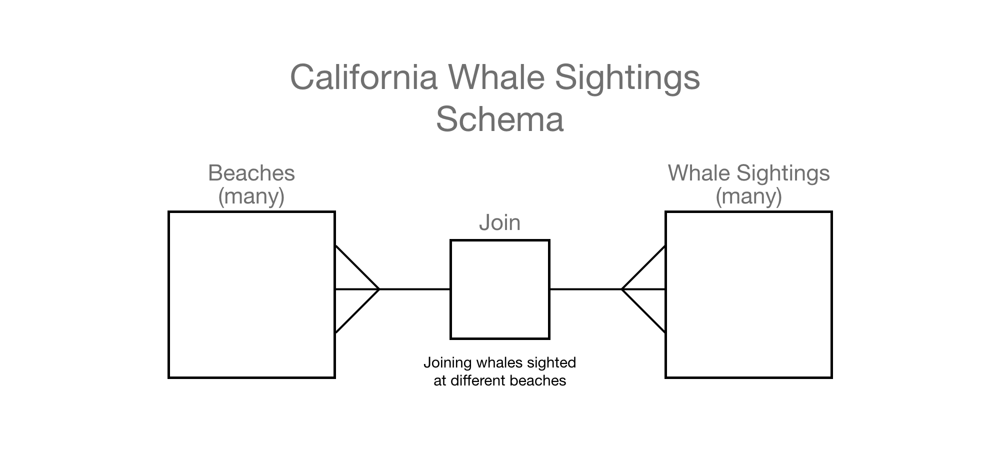

# MOD 4 BYOB - California Whale Sightings 🐳

By:
[Matthew Malone](https://github.com/matthewdshepherd)

## [Califronia Whale Watchers Front End API Documentation](https://matthewdshepherd.github.io/whalewatchers/)

## Table of Contents
* [Schema](#Schema)
* [End Points](#End-Points)
* GET Endpoints
* POST Endpoints
* DELETE Endpoints
* [API's used](#API's-used)
* [Project Management Board](#Project-Management-Board)


## Schema
Many to Many<br/>
Many beaches have many whale sigthings.<br/>
Many Whales have been sighted at many different beaches.

<details>
  <summary>  Beach Info Object Example  </summary>

  ```js
   {
    "ID": 36,
    "COUNTY": "Del Norte",
    "NameMobileWeb": "Crescent Beach Picnic Area",
    "LocationMobileWeb": "Enderts Beach Rd., .5 mi. S. of Hwy. 101",
    "DescriptionMobileWeb": "A scenic overlook is at S. end of Enderts Beach Rd.",
    "PHONE_NMBR": "",
    "FEE": "No",
    "PARKING": "Yes",
    "DSABLDACSS": "Yes",
    "RESTROOMS": "Yes",
    "VISTOR_CTR": "No",
    "DOG_FRIENDLY": "Yes",
    "EZ4STROLLERS": "Yes",
    "PCNC_AREA": "Yes",
    "CAMPGROUND": "No",
    "STRS_BEACH": "No",
    "PTH_BEACH": "Yes",
    "VOLLEYBALL": "",
    "FISHING": "Yes",
    "BOATING": "No",
    "GEOGR_AREA": "E. Crescent Beach to Lagoon Creek",
    "Photo_1": "",
    "Photo_2": "",
    "Photo_3": "",
    "Photo_4": "",
    "BIKE_PATH": "No"
  }
  ```
</details>

<details>
  <summary>  Whale Sighting Info Object Example  </summary>

  ```js
   {
      "species": "harbor porpoise",
      "quantity": "20",
      "sighted_at": "2017-10-01T00:38:00Z",
      "orca_type": "unknown",
      "beachId": 36,
      "beachName": "Crescent Beach Picnic Area"
    }
  ```
</details>

## End Points
<details>
  <summary> <code>GET</code> endpoints </summary>

##### 1. All Beaches 
GET path:`/api/v1/beaches`
- Sample Response (ok) status: 200
- Will return an array of all beaches, each as an object.
- Each beach object will contain the following:
```js
[{
    "ID": 1,
    "COUNTY": "Del Norte",
    "NameMobileWeb": "Pelican State Beach",
    "LocationMobileWeb": "W. of Hwy. 101, .5 mi. S. of Oregon border",
    "DescriptionMobileWeb": "Wide beach with driftwood, day use only",
    "PHONE_NMBR": "",
    "FEE": "No",
    "PARKING": "Yes",
    "DSABLDACSS": "No",
    "RESTROOMS": "No",
    "VISTOR_CTR": "No",
    "DOG_FRIENDLY": "",
    "EZ4STROLLERS": "",
    "PCNC_AREA": "",
    "CAMPGROUND": "No",
    "STRS_BEACH": "No",
    "PTH_BEACH": "Yes",
    "VOLLEYBALL": "",
    "FISHING": "Yes",
    "BOATING": "No",
    "GEOGR_AREA": "A. Northern Del Norte",
    "Photo_1": "https://www.coastal.ca.gov/access-photos/02_del_norte/02_northern_del_norte/Pelican_State_Beach_2013_07_01_4908.jpg",
    "Photo_2": "https://www.coastal.ca.gov/access-photos/02_del_norte/02_northern_del_norte/Pelican_State_Beach_SFS_2013_07_01_4903.jpg",
    "Photo_3": "",
    "Photo_4": "",
    "BIKE_PATH": "No"
  }]
```
- `Sample Response (error) status: 404`
```js
{ error: "Cannot retrieve Beach Data (try again just for the halibut)" }
```

##### 2. All Whale Sightings
GET path:`/api/v1/whale_sightings`
- Sample Response (ok) status: 200
- Will return an array of all sightings from all beaches 
- Each sighting object will contain the following:
```js
[{
      "species": "orca",
      "quantity": null,
      "sighted_at": "2016-10-07T23:56:00Z",
      "orca_type": "southern resident",
      "beachId": 1,
      "beachName": "Pelican State Beach"
}]
```
- Sample Response (error) status: 404
```js
{ 
  error: "Cannot retreive Whale Sightings Data (this blows)" 
}
```

##### 3. A Single Beach with all beach statics
GET path: `/api/v1/beaches/:id`
- Sample Response (ok) status: 200
- Will return an the single requested beach as an object.
- Each beach object will contain the following:
```js
{
    "ID": 1,
    "COUNTY": "Del Norte",
    "NameMobileWeb": "Pelican State Beach",
    "LocationMobileWeb": "W. of Hwy. 101, .5 mi. S. of Oregon border",
    "DescriptionMobileWeb": "Wide beach with driftwood, day use only",
    "PHONE_NMBR": "",
    "FEE": "No",
    "PARKING": "Yes",
    "DSABLDACSS": "No",
    "RESTROOMS": "No",
    "VISTOR_CTR": "No",
    "DOG_FRIENDLY": "",
    "EZ4STROLLERS": "",
    "PCNC_AREA": "",
    "CAMPGROUND": "No",
    "STRS_BEACH": "No",
    "PTH_BEACH": "Yes",
    "VOLLEYBALL": "",
    "FISHING": "Yes",
    "BOATING": "No",
    "GEOGR_AREA": "A. Northern Del Norte",
    "Photo_1": "https://www.coastal.ca.gov/access-photos/02_del_norte/02_northern_del_norte/Pelican_State_Beach_2013_07_01_4908.jpg",
    "Photo_2": "https://www.coastal.ca.gov/access-photos/02_del_norte/02_northern_del_norte/Pelican_State_Beach_SFS_2013_07_01_4903.jpg",
    "Photo_3": "",
    "Photo_4": "",
    "BIKE_PATH": "No"
  }
```
- Sample Response (error) status: 404
```js
{ 
  error: `Could not get beach with id 22, Can you please be more Pacific?`
}
```
##### 4 100 most recent Whale Sightings associated with a specific requested beach by id
Path: `/api/v1/beaches/:id/whale_sightings`
- Sample Response (ok) status: 200
- Will return an array of 100 whale sight objects
- Example partial array that will be returned:
```js
[
    {
      "species": "orca",
      "quantity": "5",
      "sighted_at": "2017-11-09T18:11:00Z",
      "orca_type": "unknown",
      "beachId": 53,
      "beachName": "Coastal Trail (Humboldt)"
    },
    {
      "species": "harbor porpoise",
      "quantity": "20",
      "sighted_at": "2017-10-01T00:38:00Z",
      "orca_type": "unknown",
      "beachId": 53,
      "beachName": "Coastal Trail (Humboldt)"
    },
    {
      "species": "humpback",
      "quantity": "1",
      "sighted_at": "2017-09-03T00:45:00Z",
      "orca_type": "unknown",
      "beachId": 53,
      "beachName": "Coastal Trail (Humboldt)"
    }
]   
```
- Sample Response (error) status: 404
- Note, this is probably due to no beach with the beach id requested
```js
{ 
  error: `Could not get whale sightings with beach id 22, it might be because sea weed.`
}
```

##### 5. Get all beaches where a specific whale/marine animal was spotted
GET path: `'/api/v1/beaches/sighting_type/:id'`
- the id is the specific whale/marine animal
- Response (ok) status: 200 - will return an array of all beaches where there was a whale/marine animal sighting of the requested type.
</details>

<details>
  <summary> <code>POST</code> endpoints </summary>

##### 1. Create Whale/Marine Animal Sighting
POST path:`/api/v1/whale_sightings`
This Post requires species(whale/marine animal), sighted_at(day and time), beachdID(id of beach), beachName(name of beach).
Format of POST body:
```js
{
  species: <String>,
  quantity: <Number>, //optional
  sighted_at: <String>,
  orca_type: <String>, //optional
  beachId: <Num>,
  beachName: <String>
}
```
- Sample Response (ok) status: 201
```js
{ id: 98003}
```
- Sample Response (error) status: 422 - When all the parameters are not provided:
```js
{ 
error:  Expected format: {
          species: <String>,
          quantity: <Number>(optional),
          sighted_at: <String>,
          orca_type: <String>(optional),
          beachId: 1,
          beachName: <String>
        }. 
        You're missing a [requiredParameter] property. 
}
```
- Sample Response (error) status: 404
```js
{ error: "Cannot add whale/marine animal sighting to database, are you sure we have a planktonic relationship?" }
```

##### 2. Create Beach
POST path: `/api/v1/beaches`
This Post requires NameMobileWeb(beach name), LocationMobileWeb(beach address), DescriptionMobileWeb(brief description of beach, ex. rocky, sandy, cove, etc.), PARKING(yes or no).
Format of POST body:
```js
{
  "COUNTY": <String>,
  "NameMobileWeb": <String>,
  "LocationMobileWeb": <String>,
  "DescriptionMobileWeb": <String>,
  "PHONE_NMBR": <String>,
  "FEE": <String>,
  "PARKING": <String>,
}
```
- Sample Response (ok) status: 201
```js
{ id: 916}
```
- Sample Response (error) status: 422 - When all the parameters are not provided:
```js
{ error: Expected format: {
          "COUNTY": <String>,
          "NameMobileWeb": <String>,
          "LocationMobileWeb": <String>,
          "DescriptionMobileWeb": <String>,
          "PHONE_NMBR": <String>,
          "FEE": <String>,
          "PARKING": <String>,
        }. You're missing a [requiredParameter] property. }
```
- Sample Response (error) status: 404
```js
{ 
error: "Cannot add beach to the database, looks like it's time to Netflix and krill." 
}
```
</details>

<details>
  <summary> <code>DELETE</code> endpoints </summary>

##### 1. DELETE Whale/Marine Animal Sighting
DELETE path:`/api/v1/whale_sightings/:id`
- this only requires the id of the whale/marine animal sighting you want to delete
- Sample Response (ok) status: 201 - the id of the deleted item will be returned in an object
```js
{ id: 916}
```
- Sample Response (error) status: 422
```js
{ 
error: "Cannot delete whale/marine animal sighting from database, I'd call the Codfather" 
}
```
</details>
### API's used:
[Whale Museum](http://hotline.whalemuseum.org/api)
[California Costal Commission](https://api.coastal.ca.gov)

## Project Management Board
[Link to Project Management Board](https://github.com/users/matthewdshepherd/projects/3)
